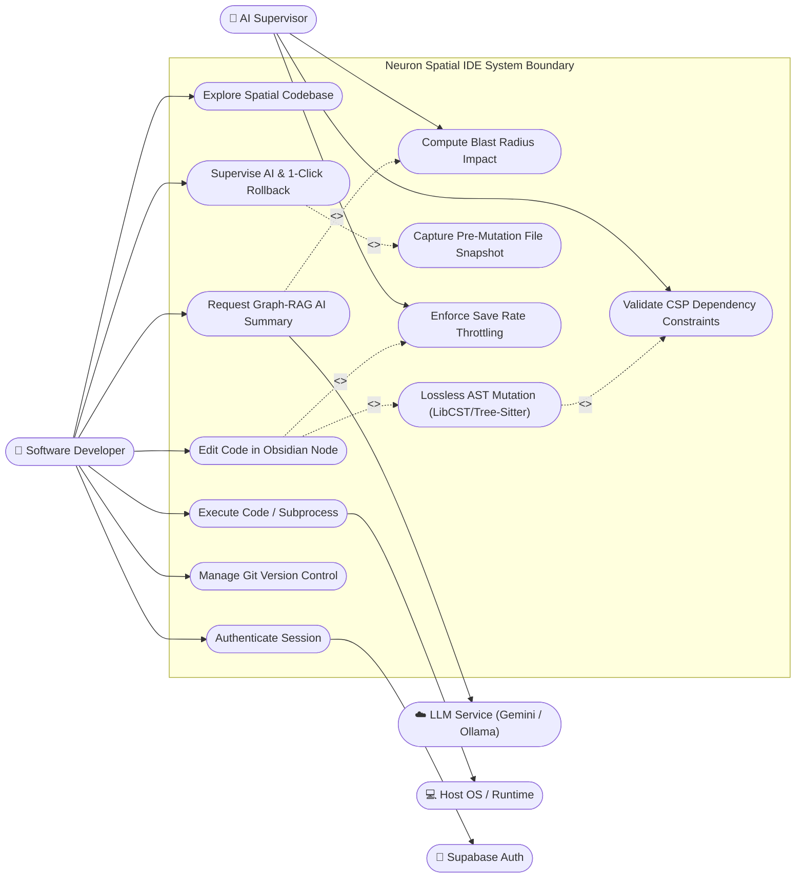
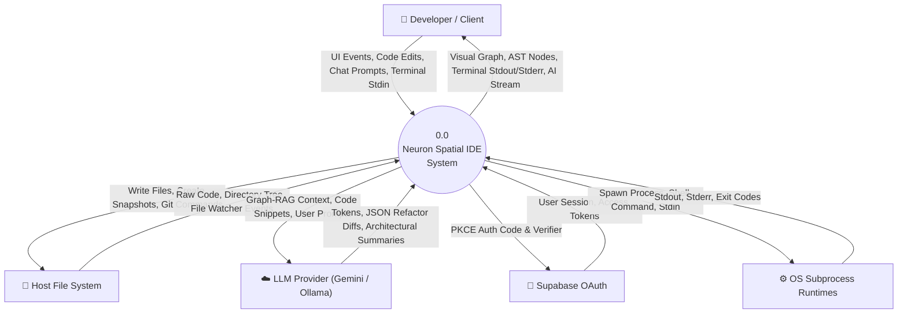
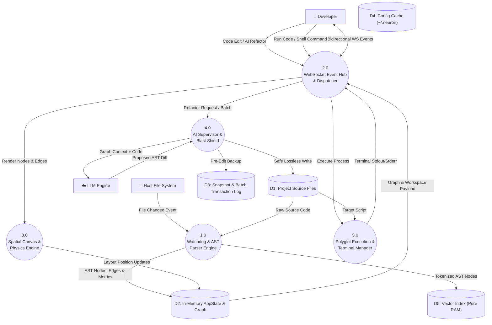
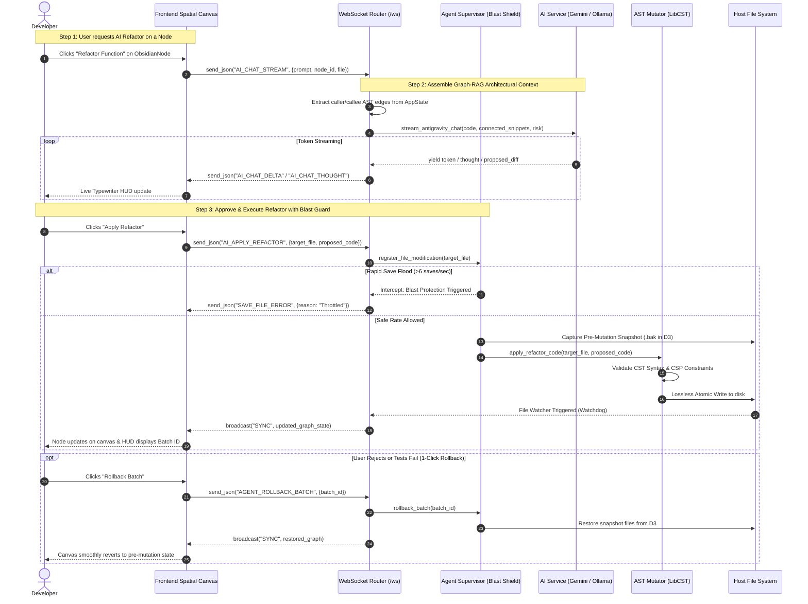
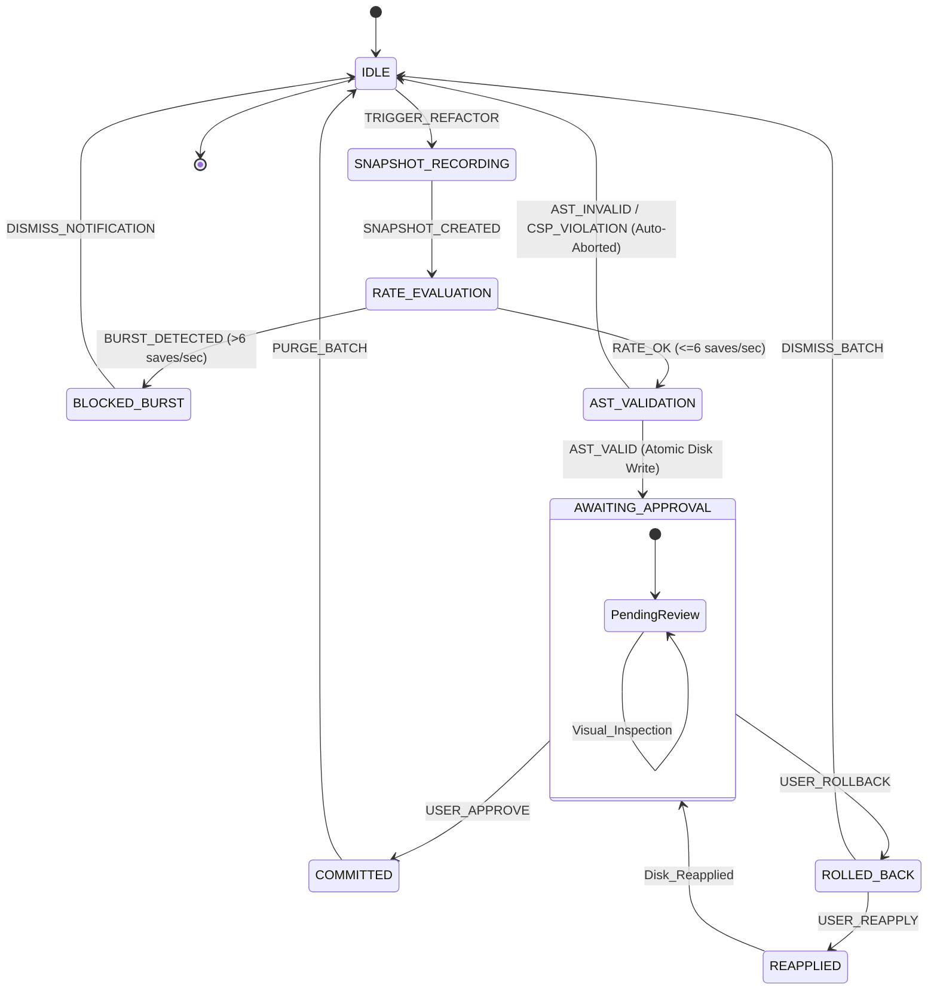

# Neuron System Design Specification

This document provides a formal Software Engineering System Design for **Neuron (The Spatial IDE)**, covering Use Case Analysis, Data Flow Modeling (DFD Levels 0 and 1), Sequence Interactions, and State Transition Dynamics.

---

## 1. Use Case Diagram

### 1.1 Identification of Primary Actors
1. **Software Developer / Engineer (Primary User):** Navigates the codebase spatially, inspects code nodes, executes code, performs edits, triggers refactorings, manages Git workflows, and interacts with the AI assistant.
2. **AI Agent / Supervisor (Autonomous Secondary Actor):** Monitors code mutations, checks burst thresholds, performs Graph-RAG code summarization, executes tool actions, and proposes/applies multi-file refactorings.
3. **Host Operating System / Execution Runtime (Supporting Actor):** Executes polyglot subprocesses (Python, Node.js, Shell), runs file system operations, and provides standard I/O pipes.
4. **Cloud Auth Provider / Supabase (External Service):** Manages Google OAuth 2.0 PKCE authentication handshakes and session verification.
5. **LLM Provider (External / Local Inference Service):** Generates architectural summaries, code completions, and refactoring plans via Google Gemini or local Ollama.

### 1.2 Main Use Cases per Actor

#### Software Developer
- **UC1: Explore Spatial Codebase** (Pan, zoom, cluster view, search nodes)
- **UC2: Edit & Mutate Code** (In-node Monaco editor, direct file save)
- **UC3: Execute Code** (Polyglot native subprocess or in-browser Pyodide)
- **UC4: Request Graph-RAG AI Insights** (Node summary, impact blast radius)
- **UC5: Supervise AI & Manage Rollbacks** (Approve batch, rollback snapshot, toggle blast protection)
- **UC6: Manage Git Version Control** (Stage, commit, push, inspect visual Git DAG)
- **UC7: Authenticate User Session** (Google OAuth via Supabase PKCE)

#### AI Agent / Supervisor
- **UC8: Monitor Mutation Bursts & Blast Protection**
- **UC9: Lossless AST Code Refactoring** (LibCST & Tree-Sitter transformations)
- **UC10: Validate Circular Dependency Constraints (CSP Guard)**

### 1.3 Use Case Diagram (Mermaid)

---

## 2. Data Flow Diagrams (DFD)

### 2.1 Main Elements & Data Dictionary
- **External Entities:**
  - `Developer`: Initiates UI actions, keystrokes, and commands.
  - `Host File System (Disk)`: Stores physical source files, configurations, and git repositories.
  - `LLM Provider (Gemini / Ollama)`: Computes embeddings, summaries, and conversational responses.
  - `Supabase Auth Service`: Validates OAuth tokens and user profiles.
  - `Subprocess Runtime`: Local OS process executing code binaries.
- **Data Stores:**
  - `D1: Host Source Files`: Raw `.py`, `.js`, `.ts`, and asset files on local disk.
  - `D2: In-Memory Graph & AppState`: Active AST nodes, edges, betweenness metrics, and WebSocket connections.
  - `D3: Snapshot & Batch Transaction Store`: Pre-modification file snapshots for rollback operations.
  - `D4: Persistent Config (~/.neuron)`: Cached auth sessions, PKCE verifiers, and user settings.
  - `D5: Vector Search Memory Store`: Pure-RAM TF-IDF & N-Gram indices for sub-millisecond semantic search.

---

### 2.2 Context Diagram (Level 0 DFD)

---

### 2.3 Level 1 Data Flow Diagram

---

## 3. Sequence Diagram

### 3.1 Use Case Selection
**Use Case:** *"Graph-RAG Node Inspection & AI Refactoring with Agent Supervisor Blast Protection & Rollback"*

### 3.2 Participating Objects & Components
1. `Dev`: Developer / User
2. `Canvas`: React Frontend (`ObsidianNode` / `PixiSpatialEngine`)
3. `WSRouter`: FastAPI WebSocket Router (`api/websocket_router.py`)
4. `Supervisor`: Agent Supervisor & Blast Shield (`ai/agent_supervisor.py`)
5. `LLM`: AI Inference Service (`services/ai_service.py` via Gemini 3.8 / Ollama)
6. `Mutator`: AST Engine (`core/mutator.py` LibCST / Tree-Sitter)
7. `Disk`: Physical Host Storage (`D1` Source Files & `D3` Snapshots)

### 3.3 Sequence Diagram (Mermaid)

---

## 4. State Transition Diagram

### 4.1 Chosen Entity
**Entity:** `AgentBatch` / `RefactorTransaction` (The lifecycle of an automated or AI-assisted codebase modification in Neuron).

### 4.2 State Identification
- **`IDLE`**: System is quiescent; awaiting user or agent mutation request.
- **`SNAPSHOT_RECORDING`**: Capturing file content hashes and pre-edit disk backups.
- **`RATE_EVALUATION`**: Burst monitor inspects the sliding timestamp window (checks if save rate $> 6\text{ saves/s}$).
- **`BLOCKED_BURST`**: Mutation intercepted and halted by Blast Protection shield.
- **`AST_VALIDATION`**: Parsing code with LibCST / Tree-Sitter to confirm syntactic validity and acyclic CSP dependencies.
- **`AWAITING_APPROVAL`**: Mutation written to disk; batch is active and highlighted on the Agent Supervisor HUD.
- **`COMMITTED`**: User approves changes; snapshots marked as resolved.
- **`ROLLED_BACK`**: User or automated rule rejects batch; pre-edit snapshots are re-written to disk.
- **`REAPPLIED`**: User chooses to redo a rolled-back transaction.

### 4.3 Transition Events
1. `TRIGGER_REFACTOR`: User or AI initiates code modification.
2. `SNAPSHOT_CREATED`: File state captured into rollback buffer.
3. `RATE_OK`: Save frequency $\le 6\text{ ops/sec}$.
4. `BURST_DETECTED`: Save frequency $> 6\text{ ops/sec}$.
5. `AST_VALID`: Code compiles into valid Concrete Syntax Tree with no circular imports.
6. `AST_INVALID`: Syntax error or CSP constraint violation detected.
7. `USER_APPROVE`: Developer confirms modification via HUD.
8. `USER_ROLLBACK`: Developer clicks 1-Click Rollback.
9. `USER_REAPPLY`: Developer clicks Reapply.
10. `PURGE_BATCH`: Batch expired or dismissed.

### 4.4 State Transition Diagram (Mermaid)

---

## 5. Summary Matrix of Design Artifacts

| UML / System Artifact | Primary Mechanism | Purpose in Neuron Architecture |
| :--- | :--- | :--- |
| **Use Case Diagram** | Actor-Goal interactions | Defines human developer vs. autonomous supervisor boundaries |
| **Context Diagram (Level 0)** | Black-box boundary mapping | Maps external I/O (Disk, Supabase, LLMs, Subprocesses) |
| **Level 1 DFD** | Process & Store decomposition | Details real-time flow between Watchdog, WebSocket Hub, and Memory Stores |
| **Sequence Diagram** | Chronological message tracing | Demonstrates Graph-RAG context synthesis, blast protection, and rollback |
| **State Diagram** | Entity lifecycle modeling | Guarantees transactional safety and deterministic recovery of code states |
